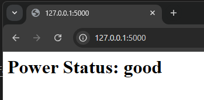

# Update log 1.0.0
- เปลี่ยนจาก discord webhook เป็น webstie ในการเช็ค (localhost นะ)
- 

# Requirement | สิ่งที่ต้องใช้
- usb ชารต์แบต
- python
- มือถือ android (any)
- [adb](https://github.com/fawazahmed0/Latest-adb-fastboot-installer-for-windows/releases/latest/download/Latest-ADB-Installer.bat)

# How to use | วิธีใช้ 
- เปิด ไฟล์ setup.bat
- กดเลข 1 แล้วทำตามที่ไฟล์ bat บอก
- เปิดไฟล์ woohoo!.py

# To do list | จะทำอะไรต่อ
- เปลี่ยนจากระบบเว็ปเป็น API แทน 
- more user friendly

